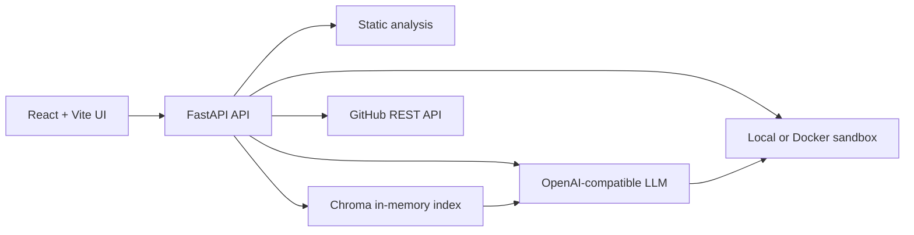

# AI Code Reviewer

AI Code Reviewer is a FastAPI and React/Vite application for source review, security analysis, GitHub inspection, repository-aware RAG, and autonomous bug fixing. A proposed repair is marked verified only after its generated or supplied tests pass in a separate sandbox.

## Features

- **Single-File Review:** deterministic static analysis followed by structured LLM findings and corrected source.
- **Sandbox Fix Agent:** generates or accepts tests, runs the baseline, proposes complete-file patches, retries repairs, and streams progress over SSE.
- **GitHub PR Mode:** inspects repositories and pull requests, fetches files, reviews them, and opens a pull request only for a sandbox-verified patch.
- **Whole-Repo RAG:** indexes Python, JavaScript, and TypeScript symbols in ChromaDB and retrieves related cross-file context for review.
- **Benchmarks:** runs eight curated Python and JavaScript repair cases with baseline, ground-truth, and autonomous-agent results.

## Architecture



The pipeline separates responsibilities:

1. Static tools find mechanical issues deterministically.
2. Groq or another OpenAI-compatible provider reasons about intent and proposes changes.
3. The sandbox executes tests outside the model conversation.
4. GitHub PR creation is available only after verification succeeds.

## Why This Is Not Just an API Wrapper

An API wrapper can forward source code to a model and display whatever patch comes back. That is useful for autocomplete, but it is not enough for a review or repair system where correctness matters.

Models are probabilistic and can produce convincing but incorrect fixes. This project therefore makes sandbox execution the acceptance boundary: a patch is not marked verified until its tests pass outside the model conversation. The baseline run also matters because it demonstrates that the test suite reproduces a failure before a fix is attempted.

Large repositories create a second problem: sending the entire repository to a model is expensive, slow, and eventually exceeds the context window. The RAG path indexes symbols and retrieves only the cross-file context relevant to the target file. That preserves useful architectural information without treating the repository as one giant prompt.

Static analysis handles another part of the reliability problem. Ruff, Python AST checks, Node syntax checks, and lightweight JavaScript security rules provide deterministic signals before the LLM review. The model receives those signals as context instead of being asked to rediscover every syntax or lint issue from scratch.

The result is a pipeline with separate responsibilities: deterministic tools find mechanical problems, the model reasons about intent and proposes changes, and the sandbox checks whether the proposed change behaves as claimed.

## Supported Languages

The review and repair APIs accept:

- `python`
- `javascript`
- `typescript`
- `c`
- `java`

Declaration-only TypeScript files ending in `.d.ts` use a focused declaration validator rather than executing generated tests.

## Sandbox Runners

Docker is preferred when `USE_DOCKER_SANDBOX=true`, Docker is reachable, and the required image is already cached. Otherwise the backend uses local subprocess execution.

| Language | Local runner | Docker image |
| --- | --- | --- |
| Python | Python with pytest/unittest fallback | `python:3.12-alpine` |
| JavaScript | Node test runner | `node:22-alpine` |
| TypeScript | Node native type stripping and test runner | `node:22-alpine` |
| C | `gcc` or `clang` | `gcc:14-bookworm` |
| Java | `javac` and `java` | `eclipse-temurin:21-jdk` |

Docker sandbox commands use no network, one CPU, a configurable memory limit, and a strict timeout. Images are not pulled during a request. Pull them before using Docker-backed execution:

```powershell
docker pull gcc:14-bookworm
docker pull eclipse-temurin:21-jdk
docker pull python:3.12-alpine
docker pull node:22-alpine
```

## Tech Stack

| Area | Technology |
| --- | --- |
| Frontend | React 18, Vite, Tailwind CSS, Axios, Lucide |
| Backend | FastAPI, Pydantic, Uvicorn |
| LLM | OpenAI-compatible client, Groq by default, legacy xAI-compatible settings retained |
| Static analysis | Ruff, Python AST checks, Node syntax checks, rule-based JavaScript checks |
| Repository context | ChromaDB with deterministic 64-dimensional hashed-token embeddings |
| Verification | Local subprocess execution or Docker |
| GitHub | GitHub REST API |

The current Groq default is `llama-3.1-8b-instant`. Other models listed in `backend/app/config.py` can be selected when supported by the account. Groq organization token-per-minute limits are provider-side and cannot be removed by this application.

## Setup

### Prerequisites

- Python 3.12+
- Node.js 20+ for the frontend
- Node.js 22+ for local TypeScript sandbox execution
- Docker Desktop for stronger isolated sandbox execution
- Groq API key for model-backed review, autonomous repair, and live agent benchmarks
- GitHub Personal Access Token for private repositories, higher API limits, or PR creation

### Backend

From the repository root:

```powershell
cd backend
python -m venv .venv
.\.venv\Scripts\Activate.ps1
pip install -r requirements.txt
```

Copy `backend/.env.example` to `backend/.env`, then fill in secrets locally. Do not commit `backend/.env` or place real keys in screenshots, documentation, frontend source, or issue reports.

Example configuration:

```dotenv
LLM_PROVIDER=groq
GROQ_API_KEY=your_groq_key
GROQ_MODEL=llama-3.1-8b-instant
GITHUB_TOKEN=your_github_token
SANDBOX_TIMEOUT_SECONDS=10
SANDBOX_MEMORY_LIMIT=512m
USE_DOCKER_SANDBOX=true
```

Start the API:

```powershell
uvicorn app.main:app --host 0.0.0.0 --port 8000
```

OpenAPI docs: [http://localhost:8000/docs](http://localhost:8000/docs)

ReDoc: [http://localhost:8000/redoc](http://localhost:8000/redoc)

Health: [http://localhost:8000/health](http://localhost:8000/health)

Without `GROQ_API_KEY`, single-file review still returns deterministic static-analysis results, but deep model review, autonomous repair, and live agent benchmarks are unavailable.

### Frontend

In a second terminal:

```powershell
cd frontend
npm install
npm run dev -- --host 0.0.0.0
```

Open [http://localhost:5173](http://localhost:5173). The frontend uses a same-origin API by default. To point it at another backend:

```powershell
$env:VITE_API_URL = "http://localhost:8000"
npm run dev -- --host 0.0.0.0
```

Build the production frontend with:

```powershell
npm run build
```

### Docker Compose

From the repository root:

```powershell
docker compose up --build
```

The frontend is served at [http://localhost:3000](http://localhost:3000) and the backend at [http://localhost:8000](http://localhost:8000). The backend build uses the repository root as its context because it imports the top-level `benchmarks` package. Compose mounts `./backend` at `/app` and `./benchmarks` at `/app/benchmarks` for development.

If port `8000` is occupied by a local Uvicorn process, stop that process or change the published host port in `docker-compose.yml`.

## API Reference

All routes are mounted by `backend/app/main.py` and are documented interactively at `/docs`.

| Method | Route | Purpose |
| --- | --- | --- |
| `GET` | `/health` | Service status, version, uptime, and Groq configuration status. |
| `POST` | `/api/review` | Static analysis and structured single-file review. |
| `POST` | `/api/agent/fix` | Synchronous autonomous repair response. |
| `POST` | `/api/agent/fix/stream` | SSE autonomous repair events and sandbox results. |
| `POST` | `/api/github/inspect` | Inspect a GitHub repository or pull request. |
| `POST` | `/api/github/fetch-file` | Fetch file contents from a repository, branch, or commit. |
| `POST` | `/api/github/open-pr` | Commit a verified replacement and open a pull request. |
| `POST` | `/api/rag/index` | Index repository files into the in-memory Chroma collection. |
| `POST` | `/api/rag/query` | Retrieve relevant cross-file symbol chunks. |
| `POST` | `/api/rag/review` | Review a target file with retrieved repository context. |
| `GET` | `/api/benchmarks/list` | List benchmark metadata and fixtures. |
| `POST` | `/api/benchmarks/run` | Run one benchmark or the full evaluation suite. |

Autonomous repair accepts `max_retries` from 1 through 5, with a default of 3. The stream endpoint returns Server-Sent Events such as test generation, baseline execution, proposed patch, sandbox result, error, and completion events.

## Configuration

| Variable | Default | Purpose |
| --- | --- | --- |
| `LLM_PROVIDER` | `groq` | Selects the active provider path. |
| `GROQ_API_KEY` | empty | Groq credential. |
| `GROQ_MODEL` | `llama-3.1-8b-instant` | Groq model. |
| `GROQ_BASE_URL` | Groq OpenAI-compatible URL | Provider endpoint. |
| `GROK_API_KEY` | empty | Legacy xAI-compatible credential fallback. |
| `GROK_MODEL` | `grok-3` | Legacy xAI-compatible model setting. |
| `GITHUB_TOKEN` | empty | Optional server-side GitHub credential. |
| `SANDBOX_TIMEOUT_SECONDS` | `10` | Execution timeout. |
| `SANDBOX_MEMORY_LIMIT` | `512m` | Docker memory limit. |
| `USE_DOCKER_SANDBOX` | `true` | Prefer cached Docker sandbox images. |
| `CORS_ORIGINS` | local origins plus `*` | Allowed frontend origins. |

The review endpoint has an in-memory limit of 60 requests per IP per hour. This is not a distributed production rate limiter. Token counts displayed by the UI come from provider `prompt_tokens` and `completion_tokens`; the displayed cost is an estimate calculated by the backend, not an invoice.

## Benchmarks

The benchmark suite is defined in [`benchmarks/dataset.py`](benchmarks/dataset.py), with a JSON dataset at [`benchmarks/dataset.json`](benchmarks/dataset.json). The evaluation harness runs baseline code, ground-truth fixed code, and the autonomous repair loop when a provider key is available.

Run it after creating the backend virtual environment:

```powershell
python benchmarks/evaluate.py
```

The checked-in report at [`benchmarks/eval_results.json`](benchmarks/eval_results.json) records the last measured run. It is a small curated suite, not a general reliability guarantee; results depend on model availability, prompt, retries, provider limits, and sandbox runtime.

## Testing

Run backend regression tests:

```powershell
cd backend
.\.venv\Scripts\Activate.ps1
python -m pytest -q
```

Tests cover API validation, GitHub parsing, RAG indexing and retrieval, rate limiting, and local sandbox execution across supported languages. Docker-backed C and Java tests require the relevant images to be cached.

Build the frontend:

```powershell
cd frontend
npm install
npm run build
```

## Deployment

- **Docker Compose:** complete local deployment; recommended when C and Java Docker sandboxes are needed.
- **Render:** configured by [`render.yaml`](render.yaml); add `GROQ_API_KEY` and restrict CORS before public deployment.
- **Fly.io:** configured by [`fly.toml`](fly.toml); use `fly secrets set GROQ_API_KEY=...` rather than storing secrets in the file.
- **Vercel:** configured by [`vercel.json`](vercel.json) for the Vite frontend; set `VITE_API_URL` when the backend is hosted elsewhere.

Hosted platforms may not provide a Docker daemon. In that case, the backend uses local subprocess execution and C/Java require `gcc` or `clang`, plus `javac` and `java`, in the runtime image. The deployment manifests retain legacy `GROK_*` compatibility variables; use explicit `GROQ_*` variables for new deployments.

## Known Limitations and Security Notes

- Chroma data is in memory and is lost when the backend restarts.
- Embeddings are deterministic hashed-token vectors, not semantic embeddings.
- RAG uses Python AST and heuristic JavaScript/TypeScript symbol extraction, not a full compiler AST.
- Sandbox verification covers one selected file and its tests; it is not a complete repository build or integration test.
- Generated tests may reference dependencies unavailable in the isolated sandbox.
- Groq TPM limits are enforced by Groq at the organization level. The application can report or retry boundedly, but cannot reset provider quota.
- CORS defaults are intentionally permissive for a demo. Restrict `CORS_ORIGINS` in production.
- Rotate any API key that has been exposed in a terminal, screenshot, chat, commit, or log. Do not put secrets in frontend code because Vite variables are shipped to browsers.

## Project Layout

```text
backend/app/api/        FastAPI route handlers
backend/app/services/   LLM, RAG, GitHub, static analysis, and sandbox logic
backend/app/models/     Pydantic request/response schemas
backend/tests/          Backend regression tests
benchmarks/             Dataset, evaluation harness, and report
frontend/src/           React application and review-mode components
docker-compose.yml      Local multi-container development
render.yaml             Render backend deployment definition
fly.toml                Fly.io backend deployment definition
vercel.json             Vercel frontend build and rewrite configuration
```
