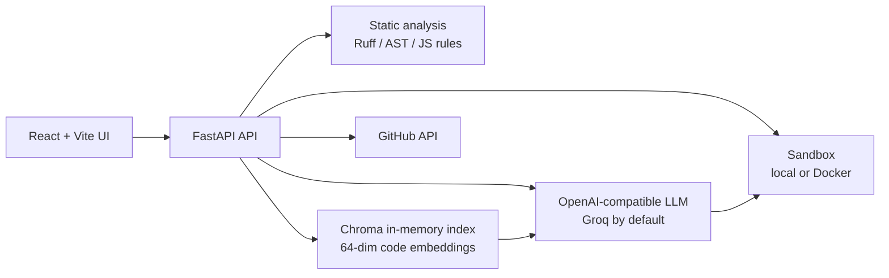

# AI Code Reviewer

AI Code Reviewer is a FastAPI and Vite application for reviewing source files, inspecting GitHub repositories and pull requests, retrieving cross-file repository context, and proposing fixes that are verified in an isolated sandbox.

The project is designed as a live demonstration of a code-review system with a verification boundary. The model can suggest a change, but the application only presents an autonomous repair as successful after the generated or supplied tests pass in a separate execution environment.

## Architecture Overview



### Main request paths

- **Single-file review:** the API runs deterministic checks first, then sends the source and those findings to the LLM. If no key is configured, the system still returns static-analysis findings through a deterministic fallback.
- **GitHub PR/repository mode:** GitHub metadata and file contents are fetched through the GitHub API. Reviewable Python, JavaScript, and TypeScript files can be selected for review. A dedicated security pass is enabled in this mode.
- **Whole-repository RAG:** supported repository files are fetched and indexed at Python AST or JavaScript/TypeScript symbol granularity. The target file is reviewed with the most relevant cross-file chunks injected into the model prompt.
- **Autonomous sandbox fix:** the agent generates or accepts tests, runs the baseline code, asks the model for a complete repaired file, and repeats until the tests pass or the retry limit is reached. The frontend receives this process as an SSE stream.

### GitHub PR auto-open

GitHub mode can continue beyond review and sandbox verification. After a fix has passed in the sandbox, the UI can open a pull request from the verified result. The backend then:

1. Resolves the target base branch and its commit SHA.
2. Creates a unique `ai-review-fix/...` branch.
3. Commits the verified replacement for the selected file through the GitHub Contents API.
4. Opens a pull request with the finding, severity, verification type, and sandbox provenance in the body.

This is intentionally a proposal workflow, not autonomous merging. A GitHub Personal Access Token is required, and the token must have permission to read the repository, create branches, write contents, and open pull requests. The generated PR explicitly states that human review, regression testing, and security review are still required. The feature is exposed through `POST /api/github/open-pr` and is available from the GitHub review and sandbox result views.

## Why This Is Not Just an API Wrapper

An API wrapper can forward source code to a model and display whatever patch comes back. That is useful for autocomplete, but it is not enough for a review or repair system where correctness matters.

Models are probabilistic and can produce convincing but incorrect fixes. This project therefore makes sandbox execution the acceptance boundary: a patch is not marked verified until its tests pass outside the model conversation. The baseline run also matters because it demonstrates that the test suite actually reproduces a failure before a fix is attempted.

Large repositories create a second problem: sending the entire repository to a model is expensive, slow, and eventually exceeds the context window. The RAG path indexes symbols and retrieves only the cross-file context relevant to the target file. That preserves useful architectural information without treating the repository as one giant prompt.

Static analysis handles another part of the reliability problem. Ruff, Python AST checks, Node syntax checks, and lightweight JavaScript security rules provide deterministic signals before the LLM review. The model gets those signals as context instead of being asked to rediscover every syntax or lint issue from scratch.

The result is a pipeline with separate responsibilities: deterministic tools find mechanical problems, the model reasons about intent and proposes changes, and the sandbox checks whether the proposed change behaves as claimed.

## Tech Stack and Decisions

| Area | Choice | Why |
| --- | --- | --- |
| Frontend | React 18, Vite, Tailwind CSS | Fast iteration for a live multi-mode demo, with a small client-side surface and streaming agent output. |
| Backend | FastAPI, Pydantic | Typed request contracts, automatic OpenAPI docs, async model/GitHub calls, and straightforward SSE streaming. |
| LLM interface | OpenAI-compatible client | Groq and xAI-compatible endpoints can be selected through configuration without coupling the application to one SDK. |
| Default model provider | Groq | Low-latency hosted inference is useful for an interactive demo and for multi-step repair loops where each attempt requires another model call. |
| Model choices | Llama, Mixtral/Mistral-family, and GPT-OSS-compatible Groq models | Different models trade off latency, reasoning quality, context size, and cost. The configuration keeps the model choice explicit rather than hard-coding one model into the UI. |
| Static analysis | Ruff, Python AST, Node syntax checks, rule-based JS checks | Gives repeatable, inexpensive findings before invoking the model. |
| Repository context | ChromaDB with deterministic hashed token embeddings | Avoids an external embedding service and download step for the demo while still supporting symbol-level retrieval. |
| Verification | Local subprocess sandbox or Docker | Keeps generated code away from the API process and provides timeout, memory, CPU, and network-isolation controls when Docker is enabled. |
| GitHub integration | GitHub REST API | Supports public repository/PR inspection and optional authenticated access without requiring a GitHub SDK in the frontend. |

The default provider is Groq, not a separate Mistral API. Mixtral is included as a Mistral-family option when it is available in the configured Groq model list. The provider and model are configurable through environment variables, while the application retains an OpenAI-compatible request shape.

## Benchmark Results

The repository includes an evaluation harness in [`benchmarks/evaluate.py`](benchmarks/evaluate.py) and eight cases in [`benchmarks/dataset.json`](benchmarks/dataset.json): four Python bugs and four JavaScript bugs covering logic errors, state leaks, security, error handling, resource/concurrency issues, and off-by-one errors.

The checked-in report in [`benchmarks/eval_results.json`](benchmarks/eval_results.json) was generated on 2026-09-05 with `GROQ_API_KEY` configured and the live autonomous repair loop enabled:

| Metric | Result |
| --- | ---: |
| Benchmarks | 8 |
| Baseline bugs reproduced | 8/8 (100%) |
| Fixes verified in sandbox | 8/8 (100%) |
| Average repair attempts | 1.0 |
| Average duration | 2,830.07 ms per snippet |
| Estimated token cost | $0.0633 total |

The headline fix metric is now a live model result: all eight cases produced a model-generated repair that passed sandbox verification on the first attempt. The harness also runs the checked-in ground-truth solution separately as a control, but `fix_verified_in_sandbox` is taken from the autonomous agent result when an active provider key is available. This is still a small, curated suite rather than evidence of general reliability; the model, prompt, retry budget, and benchmark composition all affect the result.

Run the local evaluation suite with:

```powershell
cd benchmarks
..\backend\.venv\Scripts\python.exe evaluate.py
```

Or run it from the repository root after activating the backend virtual environment:

```powershell
python benchmarks/evaluate.py
```

## Setup

### Prerequisites

- Python 3.12+
- Node.js 20+ for the frontend
- Node.js 22+ for local TypeScript sandbox execution
- GitHub token only for higher GitHub API limits or private repositories
- Groq API key for model-backed review and autonomous repair
- Docker Desktop if Docker sandbox isolation is desired

### Backend

From the repository root:

```powershell
cd backend
python -m venv .venv
.\.venv\Scripts\Activate.ps1
pip install -r requirements.txt
```

Create `backend/.env` when using model-backed features:

```dotenv
LLM_PROVIDER=groq
GROQ_API_KEY=your_groq_key
GROQ_MODEL=openai/gpt-oss-120b

# Optional GitHub authentication
GITHUB_TOKEN=your_github_token

# Optional sandbox controls
USE_DOCKER_SANDBOX=false
SANDBOX_TIMEOUT_SECONDS=10
SANDBOX_MEMORY_LIMIT=512m
```

Start the API:

```powershell
uvicorn app.main:app --host 0.0.0.0 --port 8000
```

Useful endpoints are available in the automatic docs at [http://localhost:8000/docs](http://localhost:8000/docs). Health status is available at [http://localhost:8000/health](http://localhost:8000/health).

### Frontend

In a second terminal:

```powershell
cd frontend
npm install
npm run dev -- --host 0.0.0.0
```

Open [http://localhost:5173](http://localhost:5173). The frontend uses a same-origin API by default. For a separately hosted backend, set the Vite variable before starting the dev server:

```powershell
$env:VITE_API_URL = "http://localhost:8000"
npm run dev -- --host 0.0.0.0
```

### Docker Compose

For the containerized deployment shape:

```powershell
docker compose up --build
```

The frontend is served at [http://localhost:3000](http://localhost:3000) and the backend at [http://localhost:8000](http://localhost:8000). Put `GROQ_API_KEY` and any other deployment variables in a root `.env` file before running Compose.

## Configuration Notes

- Without `GROQ_API_KEY`, single-file review remains usable through static-analysis fallback, but deep model findings and autonomous repair are unavailable.
- The review endpoint has an in-memory limit of 60 requests per IP per hour. This protects a demo deployment from accidental request storms; it is not a distributed production rate limiter.
- `USE_DOCKER_SANDBOX=true` is the intended stronger isolation mode when Docker is available. If Docker execution cannot start, the backend falls back to the local sandbox path.
- GitHub URLs can point to a repository, branch tree, or pull request. GitHub authentication is optional for public repositories but helps avoid anonymous API limits.

## Known Limitations

- The Chroma index is in memory and is not durable across backend restarts. Repository indexing must be repeated for a new process.
- The embedding function is a deterministic 64-dimensional hashed-token representation, not a semantic embedding model. It is deliberately lightweight for the demo and can miss meaning that a learned embedding would capture.
- RAG supports Python, JavaScript, and TypeScript source files, with heuristic symbol extraction for JavaScript/TypeScript rather than a full compiler AST.
- The sandbox verifies a selected file plus its generated or supplied tests. It is not a complete repository build, dependency installation, integration test, or production deployment simulation.
- Generated tests may assume project-specific dependencies that are not present in the isolated sandbox. Declaration-only `.d.ts` files therefore use a focused declaration validator rather than attempting to execute type-only code.
- The live model result depends on the selected model, prompt, API availability, and retry budget. The checked-in benchmark report does not establish live Groq-agent accuracy.
- The in-memory rate limiter is per process. Multiple backend replicas require a shared store such as Redis for consistent enforcement.
- CORS defaults are intentionally permissive for deployment previews. Production deployments should restrict `CORS_ORIGINS` to the actual frontend origins.

## Testing

Run the backend tests from the repository root:

```powershell
cd backend
.\.venv\Scripts\Activate.ps1
python -m pytest -q
```

The tests cover API validation, GitHub parsing, RAG indexing/retrieval, rate limiting, and local sandbox execution across Python, JavaScript, TypeScript, and declaration files.

## Project Layout

```text
backend/app/api/          FastAPI route handlers
backend/app/services/     LLM, RAG, GitHub, static analysis, and sandbox logic
backend/app/models/       Pydantic request/response schemas
backend/tests/            Backend regression tests
benchmarks/               Dataset, evaluation harness, and checked-in report
frontend/src/             React application and review-mode components
```